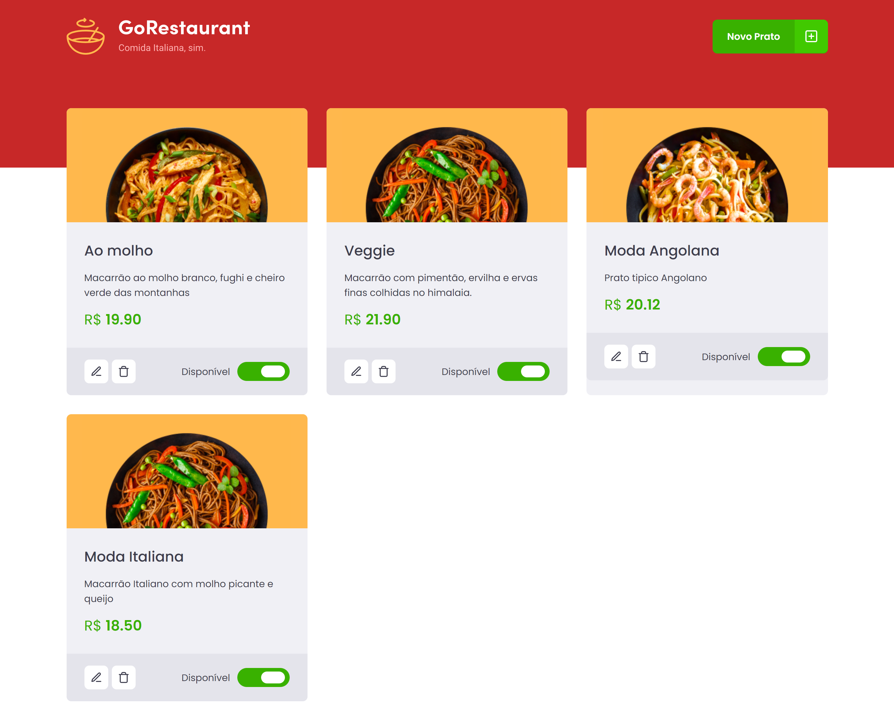

<h1 align="center">Ignite Template ReactJS Refactoring Classes & Types</h1>
<h3 align="center">Rocketseat Challenge</h3>

  

# 🚀 Techs

> - React JS
> - JavaScript to TypeScript
> - Styled Component
> - Hooks
> - Fake API com JSON Server

# 💻 Project

Creating a hook for shopping cart

# Running the Project

- Run the Server

  - `yarn`
  - `yarn server`
  - recourses
    - `/foods`

- Run the frontend
  - `yarn start`
